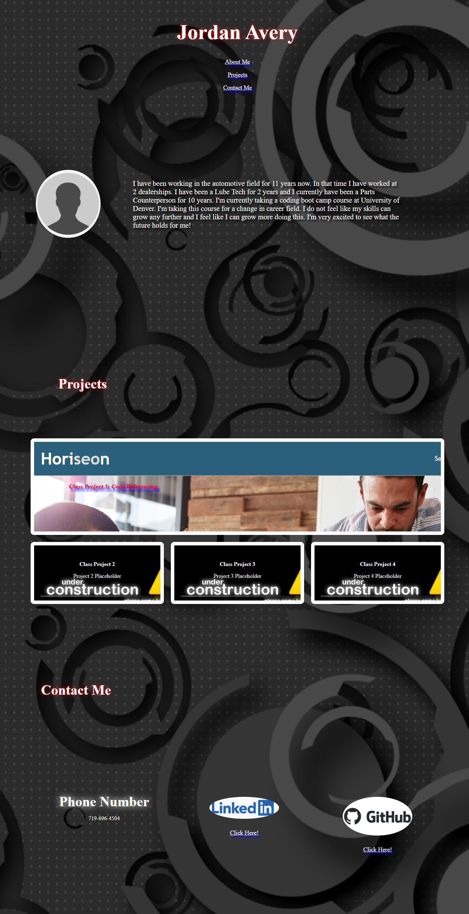

# **Portfolio**

## **Link to deployed application**
https://jjgavery.github.io/portfolio

## **Description**
Hello, My name is Jordan! Thank you for taking the time to consider my application for the open position. In my portfolio I have used my current knowledge that I have gained in school to organize my projects that I have completed and added external links to my linked in profile and my github page. I have currently been enrolled in school at the University of Denver for 1 month and I am super excited to learn more every day. So far I have learned about HTML, CSS and Javascript. This upcoming week we will be learning about API's. I will constantly be modifying my portfolio to reflect what I have learned in school. I'm highly motivated to learn as much as I can to be a full stack web developer. If I do not currently meet your criteria for the open position please keep checking back to see all of my progress. If you have any other questions please feel free to reach out to me. Thank you for your time!

## **Technologies**
- HTML
- CSS

## **Preview**
